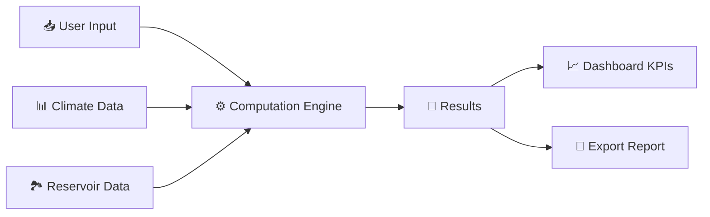

# 🎯 QUICK START GUIDE - FPV Nexus Dashboard

## 📦 3-STEP SETUP

### **Step 1: Install Dependencies**
```bash
pip install streamlit pandas numpy plotly scipy
```

### **Step 2: Navigate to Project**
```bash
cd c:\Users\AMITESH\hydro\fpv_project
```

### **Step 3: Run Dashboard**
```bash
python -m streamlit run app/dashboard.py
```

✅ **Done!** Browser opens automatically at `http://localhost:8501`

---

## 🧪 VERIFY SYSTEM WORKS

Before running dashboard, test core calculations:

```bash
python demo.py
```

Shows all computations working with sample data.

---

## 🎛️ DASHBOARD FEATURES

### Sidebar Controls (Left)
- 🏞️ **Reservoir Selection** - Choose preset or custom
- ☀️ **FPV Parameters** - Coverage %, Efficiency, PR
- 🌦️ **Climate Data** - Irradiance, Evaporation, Temperature
- 💰 **Economics** - Tariff, Emission Factor

### Main Dashboard (Center)
- 📊 **4 Key Metrics** - FPV Capacity, Water Saved, Hydro Energy, CO₂
- 📈 **Energy Mix Chart** - FPV vs Hydro contribution
- 🌍 **Environmental Impact** - Trees, Cars, Water
- 💵 **Revenue Analysis** - Annual hydro income
- 📋 **Scenario Summary** - Complete results table

---

## 🔬 CORE CALCULATIONS EXPLAINED

### 1. **FPV Power Generation**
```
Power = Area × Coverage × Irradiance × Efficiency × PR × Temp_Correction
```

### 2. **Water Savings from Shading**
```
Volume = Area × Annual_Evaporation × Shading_Factor (0.7)
```

### 3. **Extra Hydropower from Saved Water**
```
Energy = Volume × Head × Gravity × Turbine_Efficiency
```

### 4. **CO₂ Avoided**
```
CO₂ = Total_Energy × Grid_Emission_Factor (0.82 for India)
```

---

## 📊 SAMPLE RESULTS (Bhaira, 20% Coverage)

| Metric | Value |
|--------|-------|
| FPV Capacity | 162 MWp |
| Annual FPV Energy | 35,770 MWh |
| Water Saved | 8.06 Million m³ |
| Extra Hydro Energy | 656 MWh |
| CO₂ Avoided | 29,869 tonnes |
| Trees Equivalent | 1,194,760 |
| Cars Offset | 12,933 |
| Annual Revenue | ₹0.30 Crores |

---

## 🛠️ FILE STRUCTURE

```
fpv_project/
├── app/
│   └── dashboard.py              ← MAIN APP
├── models/                        ← COMPUTATION ENGINES
│   ├── fpv.py
│   ├── hydro.py
│   ├── evaporation.py
│   └── co2.py
├── utils/
│   └── data_loader.py
├── data/
│   ├── reservoir.csv
│   └── climate.csv
├── demo.py                        ← TEST/DEMO
├── requirements.txt
├── README.md
└── WINDOWS_SETUP.md              ← THIS GUIDE
```

---

## ⚡ SUPER QUICK INSTALL (Windows)

**Copy-paste this in Command Prompt:**

```cmd
cd c:\Users\AMITESH\hydro\fpv_project
pip install streamlit pandas numpy plotly scipy
python -m streamlit run app/dashboard.py
```

Browser will open automatically! 🎉

---

## 🔄 USE CASES

### Scenario 1: Small Reservoir (10% Coverage)
- Slider: Coverage → 10%
- View: Quick KPIs generation
- Export: Report

### Scenario 2: Optimal Coverage Analysis
- Slider: Coverage → 0-50% (drag)
- Chart: See energy contribution
- Decision: Choose best coverage

### Scenario 3: Climate Sensitivity
- Slider: Evaporation Variation → 0.8-1.2
- Monitor: Water savings impact
- Plan: Resilience under climate change

---

## 💾 Export Results

Click **"📥 Generate Report"** in sidebar to download scenario results as text file.

---

## 🆘 COMMON ISSUES

| Issue | Fix |
|-------|-----|
| `streamlit: command not found` | Use: `python -m streamlit run app/dashboard.py` |
| `No module named pandas` | `pip install pandas` |
| Browser doesn't open | Manually go to `http://localhost:8501` |
| Port already in use | Use: `streamlit run app/dashboard.py --server.port 8502` |

---

## 📚 LEARN MORE

- Full documentation: See **README.md**
- Computation details: See **models/*.py**
- Data sources: See **README.md § Data Sources**
- Advanced features: See **README.md § Phase 2**

---

## 🎓 PROJECT ARCHITECTURE



---

## 🚀 NEXT LEVEL

1. Modify `data/reservoir.csv` to add your own reservoirs
2. Update `data/climate.csv` with real time-series data
3. Integrate NASA POWER API (see README.md)
4. Build multi-scenario comparison
5. Deploy to cloud (Heroku, AWS)

---

## ✅ YOU'RE ALL SET!

```bash
# Remember: 3 commands to run
1. cd c:\Users\AMITESH\hydro\fpv_project
2. pip install streamlit pandas numpy plotly scipy
3. python -m streamlit run app/dashboard.py
```

**Open `http://localhost:8501` and start optimizing!** ☀️

---

**FPV Nexus Dashboard v1.0** | March 2026
